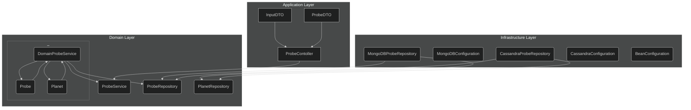

## Smart Probe

- `1` Explore Planets with a Probe
- `2` Planet area is a Cartesian Plan
- `3` Data received by system should contain: Planets, Probes and Commands thought REST interface.

### Command Sequence from Earth to a Probe :
- `M` -> Moving Forward 1 position
- `L` -> Turn left (90 graus)
- `R` -> Turn right (90 graus)


### Examples with BDD

> Given a Planet, with Size : 5x5

> Scenario 1
  - When Probe Position: x=1, y=2 North
  - And Command Sequence: LMLMLMLMM
  - Then Final Probe Position: x=1 y=3 North

> Scenario2
  - When Probe Position: x=3, y=3 East (leste)
  - And Command Sequence: MMRMMRMRRML
  - Then Final Probe Position: x=5 y=1 North
  

### Technical Challenges
 - Clean Code
 - Responsibility segregation (SOLID)
 - Hexagonal architecture (layers segregation)
 - Multi Databases Persistence (Mongo| InMemory). Switch @Principal between repository interfaces
 - Open API Documentation
 - Scalability, Availability and Performance
   - Microservices Segregation (Bounded Contexts) (TODO)
   - Multi Thread or Async Call: WebFlux | Java RX | Vertx (TODO)
   - Cloud environment configuration, like multi A-Z, autoscaling and so on.

### Business Challenge
 - Web Contract
    - How get a Set of Probes in an existing Planet ?
        - Create a Controller to list all Planets (PlanetController)
        - Planets should have an identifier and search mechanism (planetName) (findByName) 
        - Create a `ControlCenter` if many Planets will be explored (TODO)
        - Planet should know all Probes in the ground (TODO)
    - How to Move arrived Probe ?
      - Probes should have a Identifier(TODO)
      - We should know previous state (active | inactive) and position of a Probe to move it(TODO)
      - With a previous position, we can move a Probe just given it new coordinates 

 - Limited Surface and set of Probes in movement
     - Probes shall not share same Cartesian Points (ProbeCollisionException)
        - Obs: Disregard Probe
     - Probes should be limited a Planet Size (ProbeOutOfRangeException)
        - Cartesian Points of Probe must be less than Planet Size 


### Solution

  - `1` Run: docker-compose up in infra directory : teste-sonda-main > infra
  - `2` Add Lombok to a Project to omit getters and setters (Not Necessary)
  - `3` Add Mongo Spring Data to a project dependency (Maven)
  - `4` Create Layers to Segregate Persistence Types and 
    - Higher level must never depend on a lower one. 
      - https://blog.cleancoder.com/uncle-bob/2012/08/13/the-clean-architecture.html
  - `5` To Run Project: ./mvnw spring-boot:run`

Another Points: 
- https://www.alura.com.br/artigos/nao-aprender-oo-getters-e-setters
- https://www.alura.com.br/artigos/o-que-e-modelo-anemico-e-por-que-fugir-dele




```bash
POST with some Planets. Added planetName attribute to identify an Planet
  curl -X POST http://localhost:8080/planet-with-probes -H 'Content-Type: application/json' -d '{"width":10,"height":10,"planetName":"MARS","probes":[{"x":1,"y":2,"direction":"N","commands": "LMLMLMLMM"},{"x":3,"y":3,"direction":"E","commands": "MMRMMRMRRM"}]}'
  curl -X POST http://localhost:8080/planet-with-probes -H 'Content-Type: application/json' -d '{"width":20,"height":20,"planetName":"MOON","probes":[{"x":1,"y":2,"direction":"N","commands": "LMLMLMLMM"},{"x":3,"y":3,"direction":"E","commands": "MMRMMRMRRM"}]}'
```

```openapi
Customized OpenApi path:
    localhost:8080/swg.html


InputDTO -> convertProbes
  To keep layers segregated, we should convert:
    application Layers objects -> Domain Objects in own app layer object
	 