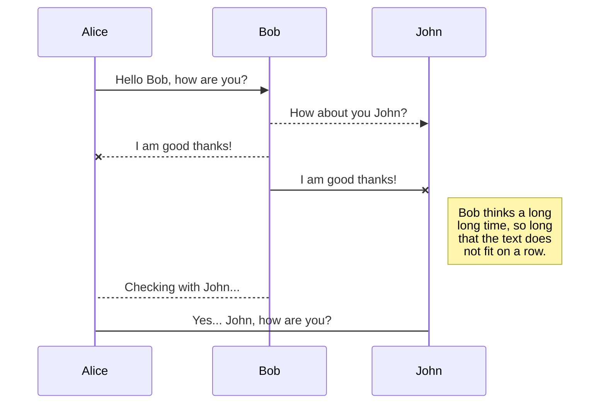

## Smart Probe

- `1` Explore Planets with an Probe
- `2` Planet area is a Carthesian Plan
- `3` Data received by system should contains: Planets, Probes and Commands throught REST interface.

### Examples with BDD

> Given a Planet, with Size : 5x5

>> Scenario 1
  - When Probe Positon: x=1, y=2 North
  - And Command Sequence: LMLMLMLMM
  - Then Final Probe Position: x=1 y=3 North

>> Scenario2
  - When Probe Positon: x=3, y=3 East (leste)
  - And Command Sequence: MMRMMRMRRML
  - Then Final Probe Position: x=5 y=1 North

### Command Sequence from Earth to a Probe :
- `M` -> Moving Foward 1 position
- `L` -> Turn left (90 graus)
- `R` -> Turn right (90 graus)

### Techinical Challenges
 - Design Pattern (evaluate)
 - Clean Code
 - Responsability segregation (SOLID)
 - Multi Databases Persistence (Onion - Hexagonal)
 - Open API Documentation
 - Microservicos Segregation (Bounded Contexts): Scalability, Disponibility and Performance

### Business Challenge
 - Web Contract
    - How get a Set of Probes in a existing Planet ?
    - How to Move arrvived Probe ?

- Limited Surface and set of Probes in movement
    - Probes shall not share same Carthesian Points
       - Obs: Consider Probe size 1x1
    - Probes should be limited a Planet Size
       - Carthersian Points of Probe must be less than Planet Size 

### Solution

  - `1` Create Layer to Change Persistence Types
    -    

Another Points: 
- https://www.alura.com.br/artigos/nao-aprender-oo-getters-e-setters
- https://www.alura.com.br/artigos/o-que-e-modelo-anemico-e-por-que-fugir-dele
- ./mvnw spring-boot:run`

